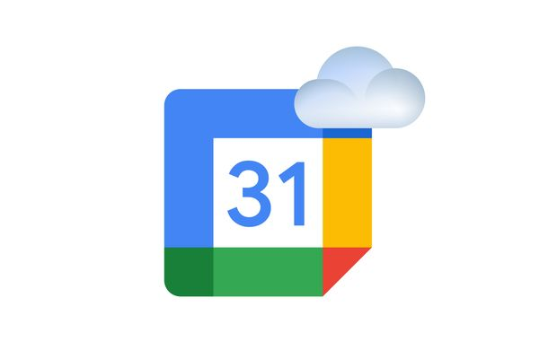

# Weather or Not

Tired of your outdoor events getting canceled due to rain? Introducing “Weather or Not”, the calendar upgrade you need to keep your plans sunny! 

## Installation instructions
This project is still under active development, with many new features and bug-fixes coming soon! To use this project before it is published to the Chrome Web Store, follow the instructions below:
1. Create a folder on your local machine to store the code
2. Use your command line to move into the newly created folder
3. Run `git clone https://github.com/katsukixyz/hackgt-9.git` in the command line
4. On your chrome browser, go to the site chrome://extensions
5. In the top right corner, turn on "Developer mode"
6. In the top left corner, click "Load unpacked"
7. Navigate to the folder you created in step 1 and then select the 'hack-gt9' folder

Now, the next time you open Google Calendar, the extension will be working!

### Update instructions
If updates have been made to this repository and you want to have them on your computer, follow these steps (assuming you previously did the steps above).
1. Open your command line and navigate to the folder you created in step 1 above
2. Navigate into the 'hack-gt9' folder
3. Run `git pull`
4. On your chrome browser, go to the site chrome://extensions
5. In the "Weather or Not" box, hit the refresh button
6. Refresh your Google Calendar

The latest changes will now be uploaded.

## Inspiration
The idea for this project came from a frequent problem we encountered in our day-to-day lives. We were very frustrated when scheduling frisbee practices as we needed to cross-reference our potential practice dates with weather conditions for those dates. In addition, it was more tricky when we tried scheduling events a few days ahead or even at a distant location. Thus, we wanted to try extending our existing calendar application with a way to view calendar events, simultaneously, along with weather.

## What it does
“Weather or Not” is a Chrome extension that adds weather-app-like functionalities to Google Calendar. While a user is using Google Calendar, whenever they go to schedule a new event, they see a little cloud button in the sidebar. If they click on that button, a little popup will appear displaying the weather for that day. This popup will be out of the way of the event box so that the user can simultaneously see the weather and edit the time and location of their event.  

## How we built it
First we had to Implement the Chrome extension API to get a local version of our Chrome extension. Then we split into two groups and designated one group to work on styling the extension (frontend) and the other group started working with the data. If a user gives permission to grab their current location, we use that longitude and latitude to get weather data from NDFD (National Digital Forecast Database). If the user does not allow us to see their location, we use the nominatim API to convert the address of their scheduled event to longitude and latitude, and then get weather data from NDFD. Meanwhile the frontend team worked on displaying a weather popup next to the calendar event box (where you edit the scheduled event). Whenever this event box appeared on the screen (when someone was trying to schedule an event), we added a button to the sidebar of the event box. When the user clicks on the button, our weather popup appears. For the weather popup, we injected custom HTML, CSS, and JavaScript to read and insert weather data into our visual popup. We also had a lot of styling modifications for a dynamic and fluid experience (dragging, side collisions)

## Challenges we ran into
Since we were building upon a preexisting application, we had no idea how interactions with the screen changed the properties of the elements. Thus, we had a lot of trouble with selecting elements on the screen to modify them, especially when those elements were moving (DOM, class names, rendering). 

We usually display the weather pop-up on the left side of the event box. However, when the weather pop-up gets too close to the left side of the screen, we wanted to move it to the right of the event box. However, there were a lot of properties on each element that would cause multiple errors (For example, the event box’s display properties changed, causing the event box to appear on the far right side of the screen). We carefully debugged many errors caused by hidden features while implementing this feature. 

Another particularly challenging portion of this project was finding decent resources to make API calls to. The webpages for the NDFD database are very outdated (last edited 2010) and we could not create API calls that gave adequately granular data for precipitation percentage. Also, we ran into trouble dealing with the timezones for the sunrise/sunset data, given that we are dealing with many parts of the country. 

## Accomplishments that we're proud of
We were able to build a functioning extension on top of an already existing application! Since no one on our team had attempted a software upgrade like this before, we are proud of how we overcame technical challenges that were out of our command. Additionally, we think our extension blends in well with the preexisting design!

## What we learned

We learned a lot about how to examine the implementations of applications like Google Calendar. Lots of existing software makes it difficult to build on top of, and some act unexpectedly since we can’t see the underlying implementation. We learned to be resourceful with the information that was available to us, dissecting aspects of Chrome DevTools we had never seen before.

## What's next for Weather or Not
In the future, we will add alert features to the application. Weather is unpredictable, and forecasts can change at any time. Thus, if a user has an event scheduled, we would notify them if the chance of rain increased significantly for that time. 

We will explore avenues to push the functionality of our application to mobile devices. 

We worked a lot with the week view of Google Calendar, and our extension still works with the month view. However in the future we will make the weather information more customized to the month view. 

Finally, we would like to expand our extension to include icons for more types of inclement weather, not just rain. 
